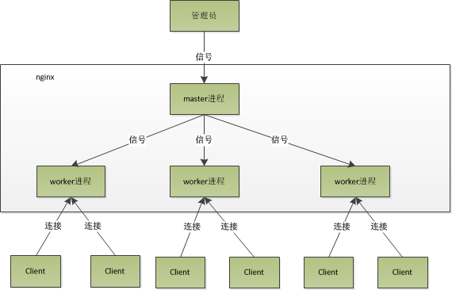

# 后端技术

## 服务器基本模型

- `Reactor`模型&`Proactor`模型

  [link](https://zhuanlan.zhihu.com/p/95662364)

## 网络库

### Nginx

- 为什么要用Nginx

> 跨平台、配置简单、方向代理、高并发连接

-  Nginx模型

-  Nginx多进程为什么高性能

> 异步，非阻塞，使用epoll，和大量细节处的优化

- 为什么Nginx要动静分离

> Nginx的静态处理能力很强，但是动态处理能力不足

- Nginx负载均衡

> 原因：
>
> 为了避免服务器崩溃，大家会通过负载均衡的方式来分担服务器压力。将对台服务器组成一个集群，当用户访问时，先访问到一个转发服务器，再由转发服务器将访问分发到压力更小的服务器
>
> 相关策略：
>
> - 轮询
> - 按权重
> - ip_hash
> - 第三方插件

## 消息队列

- 消息队列的好处

> 主要是：**解耦、异步、削峰**
>
> **解耦**：A 系统发送数据到 BCD 三个系统，通过接口调用发送。如果 E 系统也要这个数据呢？那如果 C 系统现在不需要了呢？A 系统负责人几乎崩溃…A 系统跟其它各种乱七八糟的系统严重耦合，A 系统产生一条比较关键的数据，很多系统都需要 A 系统将这个数据发送过来。如果使用 MQ，A 系统产生一条数据，发送到 MQ 里面去，哪个系统需要数据自己去 MQ 里面消费。如果新系统需要数据，直接从 MQ 里消费即可；如果某个系统不需要这条数据了，就取消对 MQ 消息的消费即可。这样下来，A 系统压根儿不需要去考虑要给谁发送数据，不需要维护这个代码，也不需要考虑人家是否调用成功、失败超时等情况
>
> **异步**：A 系统接收一个请求，需要在自己本地写库，还需要在 BCD 三个系统写库，自己本地写库要 3ms，BCD 三个系统分别写库要 300ms、450ms、200ms。最终请求总延时是 3 + 300 + 450 + 200 = 953ms，接近 1s，用户感觉搞个什么东西，慢死了慢死了。用户通过浏览器发起请求。如果使用 MQ，那么 A 系统连续发送 3 条消息到 MQ 队列中，假如耗时 5ms，A 系统从接受一个请求到返回响应给用户，总时长是 3 + 5 = 8ms。
>
> **削峰**：减少高峰时期对服务器压力

### RabbitMQ

- 架构图

## 序列化

### Protobuf

## RPC

- 基本概念
- 

## 分布式

- 什么是幂等性

> 设计理念：调用接口发生异常并且重复尝试时，总是会造成系统所无法承受的损失，所以必须阻止这种现象的发生  
> 定义：对同一个系统，使用同样的条件，一次请求和重复的多次请求对系统资源的影响是一致的

## 数据库

### Redis

- 基本数据结构

> 字符串对象：简单动态字符串
>
> 链表对象：双向链表/`ziplist`
>
> `hash`对象：哈希表/`ziplist`
>
> 集合对象：哈希表/`intset`
>
> `zset`有序集合：`ziplist`/`skiplist`

- 简单动态字符串`sds`相比`c`数组优点

> 常数时间内获得字符串长度
>
> 避免缓冲区溢出
>
> 减少字符串修改时带来的内存重新分配的次数
>
> 二进制安全

- 为什么Redis单进程还这么快

> 纯内存操作，数据结构简单，核心work线程是单线程，[采用reactor网络模型](https://segmentfault.com/a/1190000039223696).

- Redis持久化方式

> AOF, RDB

- 缓存异常以及解决方法

> **缓存雪崩**
>
> 缓存雪崩是指缓存同一时间大面积的失效，所以，后面的请求都会落到数据库上，造成数据库短时间内承受大量请求而崩掉。
>
> 解决方案
>
> - 缓存数据的过期时间设置随机，防止同一时间大量数据过期现象发生。
>   一般并发量不是特别多的时候，使用最多的解决方案是加锁排队。
>   给每一个缓存数据增加相应的缓存标记，记录缓存的是否失效，如果缓存标记失效，则更新数据缓存
>
> **缓存穿透**
>
> 缓存穿透是指缓存和数据库中都没有的数据，导致所有的请求都落到数据库上，造成数据库短时间内承受大量请求而崩掉。
>
> 解决方案
>
> - 接口层增加校验，如用户鉴权校验，id做基础校验，id<=0的直接拦截；
>   从缓存取不到的数据，在数据库中也没有取到，这时也可以将key-value对写为key-null，缓存有效时间可以设置短点，如30秒（设置太长会导致正常情况也没法使用）。这样可以防止攻击用户反复用同一个id暴力攻击
>
> - 采用布隆过滤器，将所有可能存在的数据哈希到一个足够大的 bitmap 中，一个一定不存在的数据会被这个 bitmap 拦截掉，从而避免了对底层存储系统的查询压力
>
> **缓存击穿**
>
> 缓存击穿是指缓存中没有但数据库中有的数据（一般是缓存时间到期），这时由于并发用户特别多，同时读缓存没读到数据，又同时去数据库去取数据，引起数据库压力瞬间增大，造成过大压力。和缓存雪崩不同的是，缓存击穿指并发查同一条数据，缓存雪崩是不同数据都过期了，很多数据都查不到从而查数据库。
>
> 解决方案
>
> - 设置热点数据永远不过期。
> - 加互斥锁，互斥锁

-  缓存与数据库双写时的数据一致性

> [link](https://zhuanlan.zhihu.com/p/59167071)

### Mysql