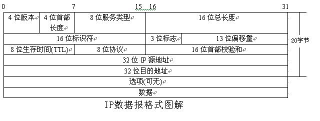
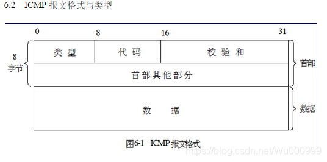
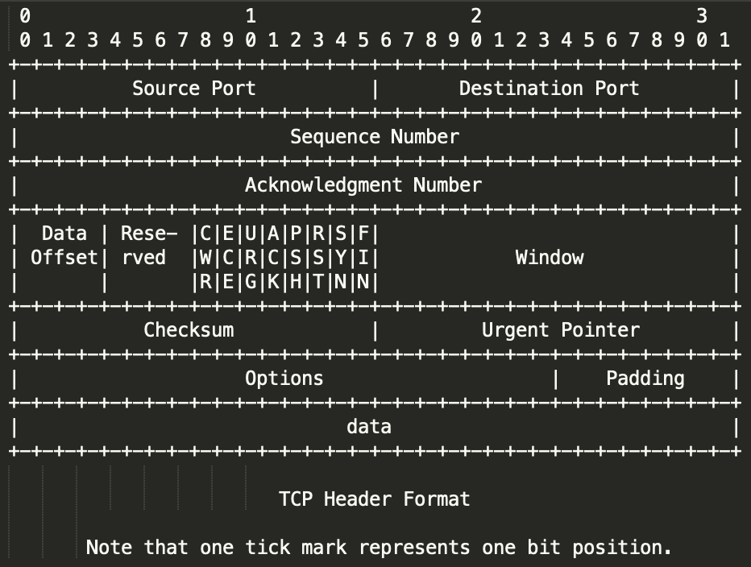
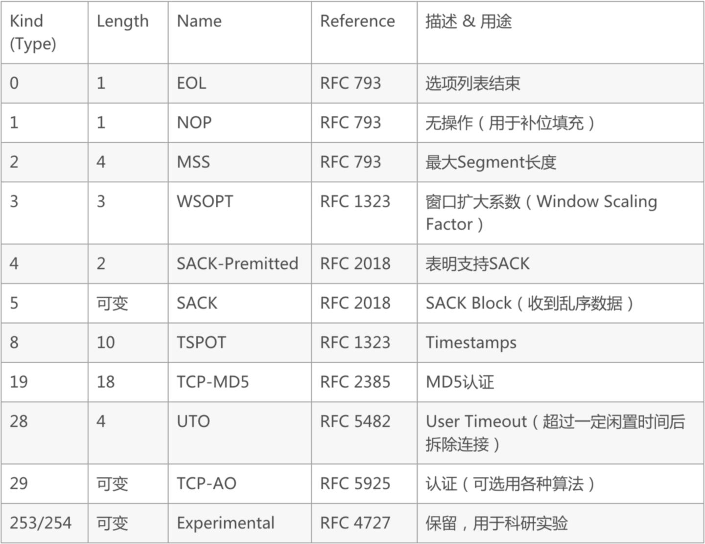
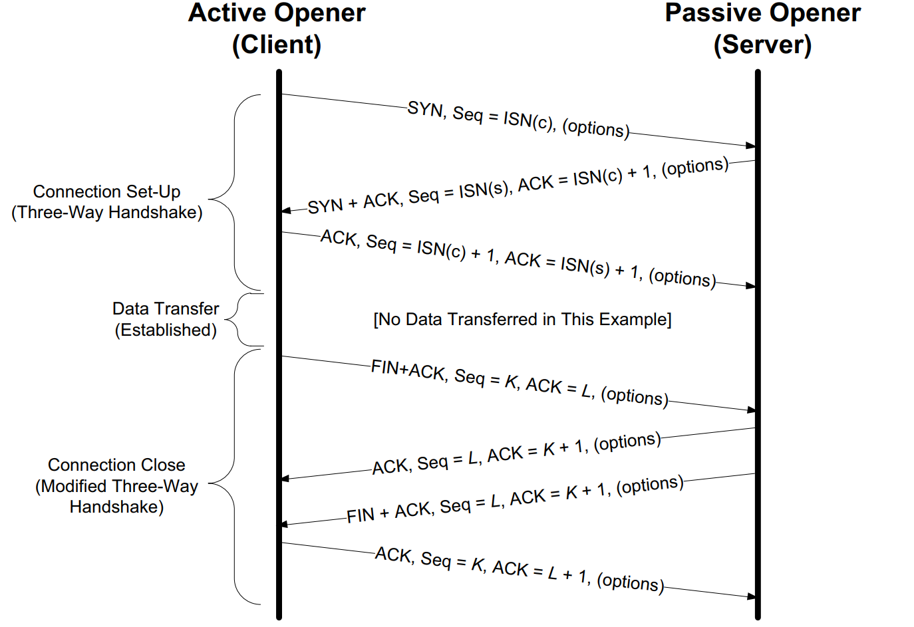

# TCP/IP详解 & HTTP/HTTPS协议

## 大纲

- 网络模型
- 链路层
- [ARP协议](#arp协议)
- [IP协议](#ip协议)
- [DHCP协议](#dhcp协议)
- [NAT协议](#nat协议)
- [ICMP协议](#icmp协议)
- [广播和多播](#广播和多播)
- [DNS](#dns协议)
- UDP
- [TCP](#tcp协议)
- [TLS](#tls协议)

## ARP协议

Address Resolution Protocol 即地址解析协议， 用于实现从 IP 地址到 MAC 地址的映射，即询问目标IP对应的MAC地址

- 代理ARP

## IP协议

IP协议是不可靠，无连接的协议，所有的TCP、UDP、ICMP及IGMP数据都以IP数据报格式传输

- IP路由选择

IP层在内存中有一个路由表。当收到一份数据报并进行发送时，它都要对该表搜索一次。当数据报来自某个网络接口时，IP首先检查目的IP地址是否为本机的IP地址之一或者IP广播地址。如果确实是这样，数据报就被送到由IP首部协议字段所指定的协议模块进行处理。如果数据报的目的不是这些地址，如果IP层被设置为路由器的功能，那么就对数据报进行转发，否则数据报被丢弃

- IP首部

一般为20字节



- IP地址分类

## DHCP协议

DHCP（Dynamic Host Configuration Protocol，动态主机配置协议）

DHCP通常被用于局域网环境，主要作用是集中的管理、分配IP地址，使client动态的获得IP地址、Gateway地址、DNS服务器地址等信息，并能够提升地址的使用率。简单来说，DHCP就是一个不需要账号密码登录的、自动给内网机器分配IP地址等信息的协议

- DHCP流程
  
1. 发现阶段，即DHCP客户机寻找DHCP服务器的阶段。DHCP客户机以广播方式（因为DHCP服务器的IP地址对于客户机来说是未知的）发送DHCP discover发现信息来寻找DHCP服务器，即向地址255.255.255.255发送特定的广播信息。网络上每一台安装了TCP/IP协议的主机都会接收到这种广播信息，但只有DHCP服务器才会做出响应。

2. 提供阶段，即DHCP服务器提供IP地址的阶段。在网络中接收到DHCP discover发现信息的DHCP服务器都会做出响应，它从尚未出租的IP地址中挑选一个分配给DHCP客户机，向DHCP客户机发送一个包含出租的IP地址和其他设置的DHCP offer提供信息。

3. 选择阶段，即DHCP客户机选择某台DHCP服务器提供的IP地址的阶段。如果有多台DHCP服务器向DHCP客户机发来的DHCP offer提供信息，则DHCP客户机只接受第一个收到的DHCP offer提供信息，然后它就以广播方式回答一个DHCP request请求信息，该信息中包含向它所选定的DHCP服务器请求IP地址的内容。之所以要以广播方式回答，是为了通知所有的DHCP服务器，他将选择某台DHCP服务器所提供的IP地址。

4. 确认阶段，即DHCP服务器确认所提供的IP地址的阶段。当DHCP服务器收到DHCP客户机回答的DHCP request请求信息之后，它便向DHCP客户机发送一个包含它所提供的IP地址和其他设置的DHCP ack确认信息，告诉DHCP客户机可以使用它所提供的IP地址。然后DHCP客户机便将其TCP/IP协议与网卡绑定，另外，除DHCP客户机选中的服务器外，其他的DHCP服务器都将收回曾提供的IP地址。

5. 重新登录。以后DHCP客户机每次重新登录网络时，就不需要再发送DHCP discover发现信息了，而是直接发送包含前一次所分配的IP地址的DHCP request请求信息。当DHCP服务器收到这一信息后，它会尝试让DHCP客户机继续使用原来的IP地址，并回答一个DHCP ack确认信息。如果此IP地址已无法再分配给原来的DHCP客户机使用时（比如此IP地址已分配给其它DHCP客户机使用），则DHCP服务器给DHCP客户机回答一个DHCP nack否认信息。当原来的DHCP客户机收到此DHCP nack否认信息后，它就必须重新发送DHCP discover发现信息来请求新的IP地址。

6. 更新租约。DHCP服务器向DHCP客户机出租的IP地址一般都有一个租借期限，期满后DHCP服务器便会收回出租的IP地址。如果DHCP客户机要延长其IP租约，则必须更新其IP租约。DHCP客户机启动时和IP租约期限过一半时，DHCP客户机都会自动向DHCP服务器发送更新其IP租约的信息。

## NAT协议

[链接](https://zhuanlan.zhihu.com/p/171951691)

## ICMP协议

ICMP协议的全称是网际控制报文协议（Internet Control Message Protocol）核心作用就是对上层协议报告数据包传递时的差错

- ICMP 查询报文
- ICMP 差错报文
- 报文头



## 广播和多播

- [链接1](https://www.cnblogs.com/yougewe/articles/9516786.html)
- [链接2](https://zhuanlan.zhihu.com/p/245548579)

## DNS协议

- [链接](https://space.bilibili.com/360996402?spm_id_from=333.788.b_765f7570696e666f.2)

## UDP协议

## TCP协议

### 简介

- TCP协议是面向连接，可靠，全双工单播的字节流服务

- TCP报文头



- 控制位

```shell
CWR：用于 IP 首部的 ECN 字段。ECE 为 1 时，则通知对方已将拥塞窗口缩小。
ECE：在收到数据包的 IP 首部中 ECN 为 1 时将 TCP 首部中的 ECE 设置为 1，表示从对方到这边的网络有拥塞。
URG：紧急模式
ACK：确认
PSH：推送，接收方应尽快给应用程序传送这个数据。没用到
RST：该位为 1 表示 TCP 连接中出现异常必须强制断开连接。
SYN：初始化一个连接的同步序列号
FIN：该位为 1 表示今后不会有数据发送，希望断开连接。
```

- TCP选项



### TCP连接管理

- 一次TCP连接



- 三次握手&四次挥手&TIME_WAIT时间
  
[链接1](https://blog.csdn.net/qzcsu/article/details/72861891)
[链接2](https://zhuanlan.zhihu.com/p/53374516)

### TCP超时和重传

## TLS协议

- [连接1](https://zhuanlan.zhihu.com/p/133375078#:~:text=TLS%E4%B8%BB%E8%A6%81%E5%88%86%E4%B8%BA%E4%B8%A4,%E6%9C%80%E6%9C%80%E5%A4%8D%E6%9D%82%E7%9A%84%E9%83%A8%E5%88%86%E3%80%82)
- [连接2](https://www.ruanyifeng.com/blog/2014/02/ssl_tls.html)